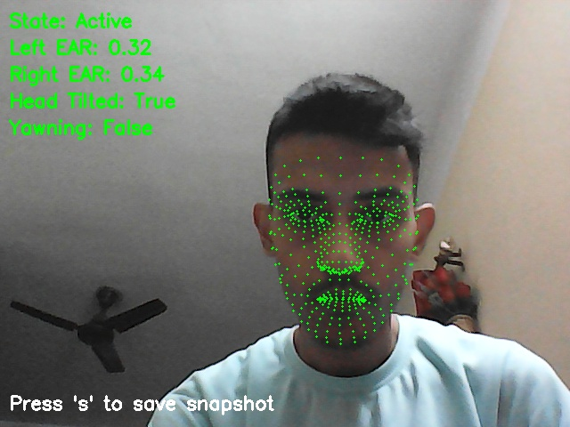

# Drowsiness Detector

A drowsiness detection system using facial landmarks and hand detection to monitor user alertness.

## Features

- **Real-time drowsiness detection:** Uses facial landmarks for monitoring.
- **Head tilt detection**
- **Yawning detection**
- **Sound alert:** Emits a sound when drowsiness is detected.
- **Event logging:** Logs drowsiness events with timestamps.
- **Data visualization:** Plots drowsiness states over time.

## Requirements

- Python 3.12.x
- OpenCV
- NumPy
- Mediapipe
- Pygame
- Matplotlib
- Winsound (for Windows)

## Installation

### Standard Installation

1. Clone the repository:
   ```sh
   git clone https://github.com/CodeRTX/drowsiness-detector.git
   cd drowsiness-detector
   ```
2. Install the required packages:
   ```sh
   pip install opencv-python numpy mediapipe pygame matplotlib
   ```

### Alternative Installation Using Pre-built Dependencies

Alternatively, you can use the provided `.whl file` and `requirements.txt` for easy installation of modules/packages:

1. Create a folder named drowsiness_detector_setup and place the .whl file and requirements.txt inside it.
2. Follow the instructions in the `INSTALLATION_GUIDE.txt` provided in the `installation_files/` folder.

## Usage
* Run the drowsiness detection script:
   ```sh
   python drowsiness_detection_using_deep_learning.py
   ```
The system will start monitoring your face for signs of drowsiness.
* Press 's' to save a snapshot of the current frame.
* Press 'Esc' to exit the program.

## Real-time Demonstration

Below is an image showcasing the drowsiness detection system in action:



## Files

* `drowsiness_detection_using_deep_learning.py`: Main script for drowsiness detection.
* `ringg.mp3`: Ringtone file for sound alert.
* `flowchart.png`: Flowchart of the workflow.
* `logs/events.csv`: Log file for drowsiness events.
* `logs/enhanced_events_plot.png`: Plot of drowsiness states over time.
* `snapshots/snapshot_20241010-165027.jpg`: Example snapshot of facial features.
* `installation_files/`: Directory containing the `.whl`, `requirements.txt`and the `INSTALLATION_GUIDE.txt` files.

## Limitations

Everything works fine, as intended, with only one exception: while the hand is covering the face, the 'DROWSY' alert will show up, irrespective of whether the person is yawning or not.

## Contributing

Pull requests are welcome. For major changes, please open an issue first to discuss what you would like to change.

## License

This project is licensed under the APACHE 2.0 License.
